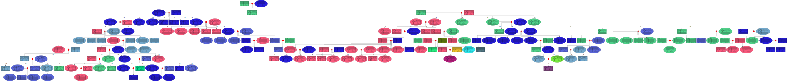

## A05 - Family Tree using Graphviz
### Madhav Adhikari
### Description:
We used a tool like the following: http://mcdemarco.net/tools/family-tree-generator/lineage.html to generate our own unique family tree and clean it by using random names and ages.Then I  will do followong steps to make family tree of this data

- Read family_tree_data.csv  data using pandas which help to generate datframe of each row of csv
- sort the data by generation and with that group sort by id; find the oldest patriarch or matriarch  and its on the top of data  frane
- Iterating  the data for each person 
- Make subgraph for spouse with same rank level that left to right  and connect spouse by diamond shape and red edges
- Add child node without same level that top bottom by default and conenct to respective parent 
- Shape of node according to gender: rectangular for Male and ellipse for female 
- Use HTML table tag to make table in the node to display information of person
- Differnt color of node accrding of clan name : Same color for same clan nodes
- Generated the dot files 
- Preview dot file in dot language IDE then download the image of family tree 

## Result

 

 I also tried alternative way to solve this problem as learning purpose by refrencing [Family tree](https://medium.com/@ahsenparwez/building-a-family-tree-with-python-and-graphviz-e4afb8367316) and it aslo generated good graph. The below alternative files keep as it for learning purpose :) 

 

### Files

|   #   | File            | Description                                        |
| :---: | --------------- | -------------------------------------------------- |
|   1   | [family_tree_data.csv](family_tree_data.csv )       | file that data for family tree   |
|   2  |[ family_tree_dot_generator.py](family_tree_dot_generator.py )      | file that holds python code to generate dot files    |
|   3  | [family_tree.dot](family_tree.dot)      | file that holds dot files of family tree    |
|   4   | [family_tree.svg](family_tree.svg)     | file that holds image of family tree    |
|   5   | [requirements.txt](requirements.txt)      | file that holds  list of dependencies    |
|   6  | [family_tree_dot_generator_alternative.py](family_tree_dot_generator_alternative.py)     | file that holds python code to generate dot files (  alternative method)    |
|   7  |[family_tree_alternative.dot](family_tree_alternative.dot)     | file that holds dot files of family tree  (  alternative method)  |
|   8   | [family_tree_alternative.svg ](family_tree_alternative.svg)     | file that holds image of family tree  (  alternative method)  |
|   9  |  [clean_data.py](clean_data.py)     | file that used to clean data  |

### Instructions

- Make sure you install requirements.txt compontes
- Run family_tree_dot_generator.py
- Place dot files in online dot editor or install Graphviz preview Extension in your IDE

### Example Command:
- python family_tree_dot_generator.py

