## A06 - Software Tool (Postman) Presentation
### Madhav Adhikari


# Background about API:

### What is an API?
An API ( Application Programming Interface) is collection of functions and procedures that allows two software components communicate and share data. For instance, a weather app on a smartphone uses an API to get daily weather information from a service. To provide weather updates to the user, a phone's weather app talks to this system via APIs.

### How do APIs Work?
- The client initiates the requests via the APIs URI (Uniform Resource Identifier)
- The API makes a call to the server after receiving the request
-  Then the server sends the response back to the API with the information
- Finally, the API transfers the data to the client

Workflow (ref: picture copy from internet): 


URL structure:

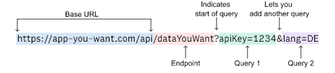


### How is an API Different From a Web Application?

An API acts as an interface that allows proper communication between two programs whereas a web application is a network-based resource responsible for completing a single task. Also, it’s important to know that “All web services are APIs, but not all APIs are web”.


### Types of APIs

- SOAP (SIMPLE OBJECT ACCESS PROTOCOL): It defines messages in XML format used by web applications to communicate with each other.
- REST (Representational State Transfer): It makes use of HTTP to GET, POST, PUT, or DELETE data. 
- JSON-RPC: It uses JSON for data transfer and is a lightweight remote procedural call defining a few data structure types  and are commonly used in distributed computing environments.remote procedure calls (RPC)
- XML-RPC: It is based on XML and uses HTTP for data transfer. This API is widely used to exchange information between two or more networks.
-  GraphQL APIs : type of API that uses the GraphQL query language for data retrieval and manipulation. With GraphQL APIs, clients can request specific data requirements and receive a structured response, giving them more control over the data they receive.

### HTTP methods and status code 

Method: 


Status code:


### What is API Testing?

API Testing is a crucial part of software development that ensures APIs function as intended, with checks for functionality, security, performance, and reliability. It validates the API's behavior and prompts adjustments if needed. 

API testing involves : 

- Functionality: Verify that the API functions correctly by testing different endpoints, request methods, and parameters. Ensure that the API behaves as expected and returns accurate responses.

- Data Validation: Test the API's ability to validate and handle different types of data inputs, such as valid and invalid data, edge cases, and boundary conditions. Validate that the API rejects invalid data and handles various data formats properly.

- Error Handling: Test how the API handles errors and exceptions. Ensure that appropriate error codes and messages are returned for different scenarios, such as invalid requests, authentication failures, or server errors.

- Security: Evaluate the API's security measures, including authentication and authorization mechanisms. Test the API for vulnerabilities such as SQL injection, cross-site scripting (XSS), and sensitive data exposure.

- Performance: Assess the API's performance by testing its response time, throughput, and scalability under normal and peak load conditions. Verify that the API can handle high traffic volumes without performance degradation.

- Integration: Test the API's integration capabilities with other systems or services it interacts with. Ensure smooth data exchange and functionality across different components or third-party integrations.

- Compatibility: Test the API's compatibility with different platforms, devices, browsers, or client applications that consume the API. Validate that the API works consistently across various environments.

- Documentation: Evaluate the accuracy and completeness of the API documentation. Verify that the documentation provides clear instructions on how to use the API, including available endpoints, request parameters, response formats, and error handling guidelines.

### Some Tools for Testing API:
- Postman
- SoapUI
- Insomnia
- JMeter
- Newman
- Swagger (OpenAPI) Tools
- Karate
- CURL


# Postman

Postman is a  platform for API Development Testing Management.

Walkthrough :

### Workspace :
In Postman, a workspace is a collaborative environment where you can organize and manage API-related resources such as collections, environments, and documentation. Workspaces allow teams to work together, share resources, and maintain a structured approach to API development and testing

### Request and Response :
Get :

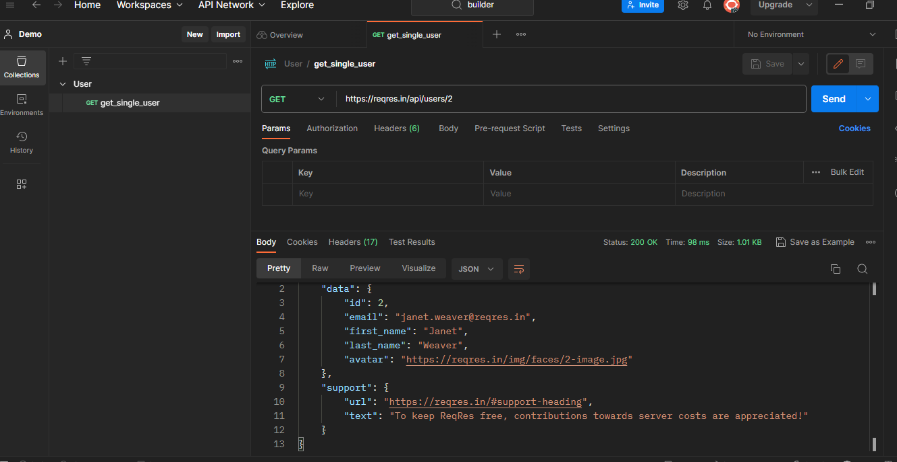


Post :


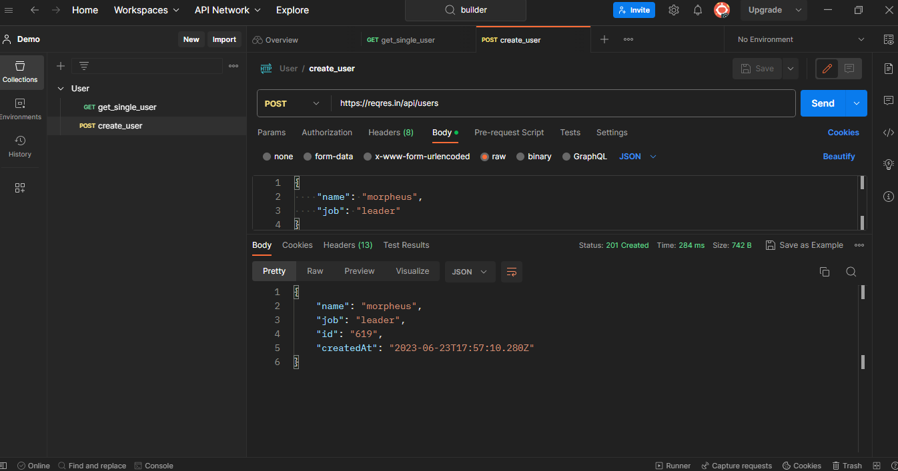

### Collection:
Collection is a container that holds a group of API requests. It helps you organize and manage your API endpoints (folder), allowing for efficient testing, documentation, and collaboration.

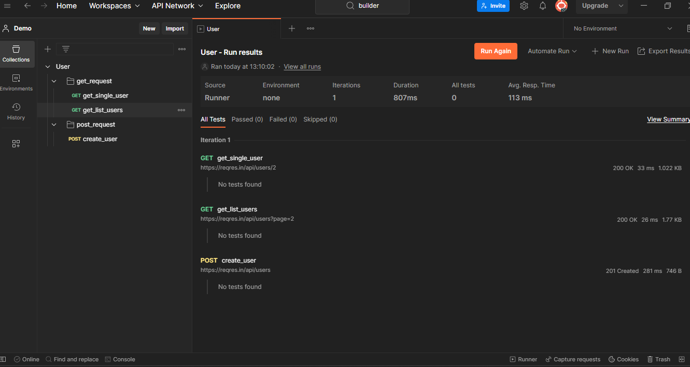


### Enviroment :
Environment is a way to manage variables used in API requests. It allows you to define different configurations such as base URLs, authentication tokens,user name, password headers for development, staging, QC, SandBox, UAT and production environments, making it easier to switch between them and maintain consistent testing and documentation.

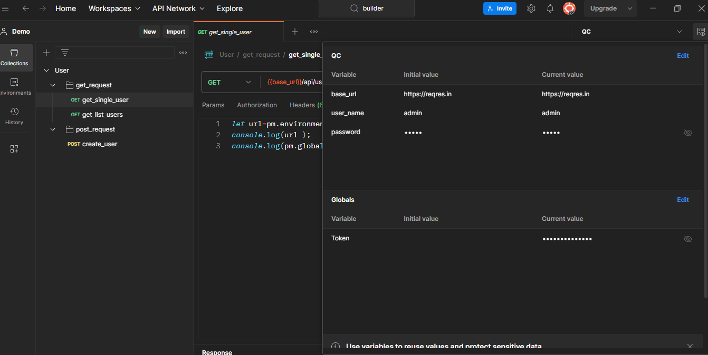


### Variable :
Postman variables are placeholders used to store and reuse dynamic values in API requests and scripts. They allow for flexibility, customization, and reusability of requests. Variables can be global, environment-specific, collection , data driven or local to a request. They are represented using double curly braces ({{variable_name}}) and can be used in various parts of a request. Variables provide scoping and inheritance, dynamic updates, and can be managed within Postman's user interface. 

### Authorization : 

It is used ro verify the identity.Select the appropriate method (API Key,Basic Authentication, Bearer Token,OAuth 2.0, Digest Authentication) based on your API's authentication requirements, and configure the necessary details within Postman.

Example:
https://api.github.com/user/repos
Step 1 - Create a api request
Step 2 - Goto Authorization tab
Step 3 - Add authorization as needed
Step 4 - Save & Run

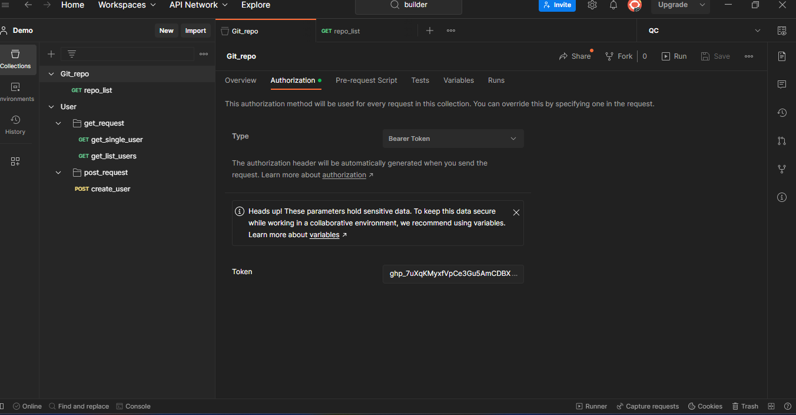

### Test script  :

You can add JavaScript code to execute during two events in the flow:

Before a request is sent to the server, as a pre-request script under the Pre-request Script tab (example install plugin libaries , chaining multiple url, request validation ).

After a response is received, as a test script under the Tests tab
prequest before request 


Example Data driven create and  test :
Url : Post : https://api.github.com/user/repos
Make collection, add request, write test case and run collection by provding file (repo_data.json)

```json

 body :  {
    "name": "{{name}}",
    "description": "{{description}}",
    "homepage": "{{homepage}}",
    "private": "{{private}}",
    "is_template": "{{is_template}}"
  }
  ```


```javascript

Test cases:
pm.test("Verify status code is 201", function () {
    pm.response.to.have.status(201);
});

pm.test("Verify Body matches string", function () {
    pm.expect(pm.response.text()).to.include("Demo");
});

pm.test("Verify private value", function () {
    var jsonData = pm.response.json();
    pm.expect(jsonData.private).to.eql(true);
});
```

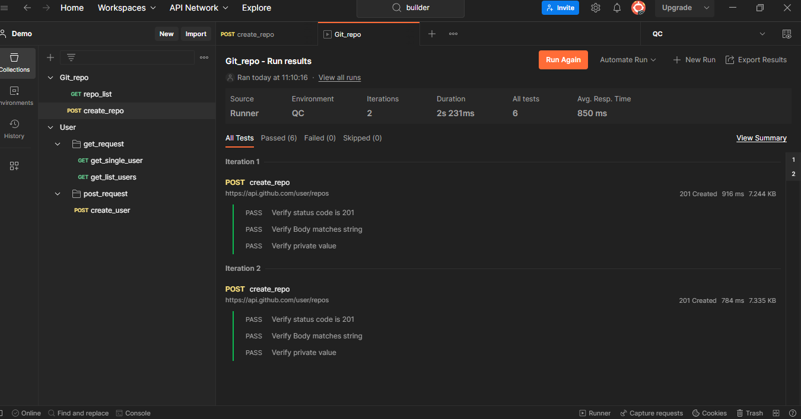


Scehma validator example :

Url get : https://reqres.in/api/users/2

Test case :
```javascript
// Define the JSON schema
var schema = {
    "type": "object",
    "properties": {
        "data": {
            "type": "object",
            "properties": {
                "id": { "type": "number" },
                "email": { "type": "string", "format": "email" },
                "first_name": { "type": "string" },
                "last_name": { "type": "string" },
                "avatar": { "type": "string", "format": "uri" }
            },
            "required": ["id", "email", "first_name", "last_name", "avatar"]
        },
        "support": {
            "type": "object",
            "properties": {
                "url": { "type": "string", "format": "uri" },
                "text": { "type": "string" }
            },
            "required": ["url", "text"]
        }
    },
    "required": ["data", "support"]
};

// Validate the response against the schema
pm.test("Schema validation", function () {
    pm.response.to.have.jsonSchema(schema);
});
```
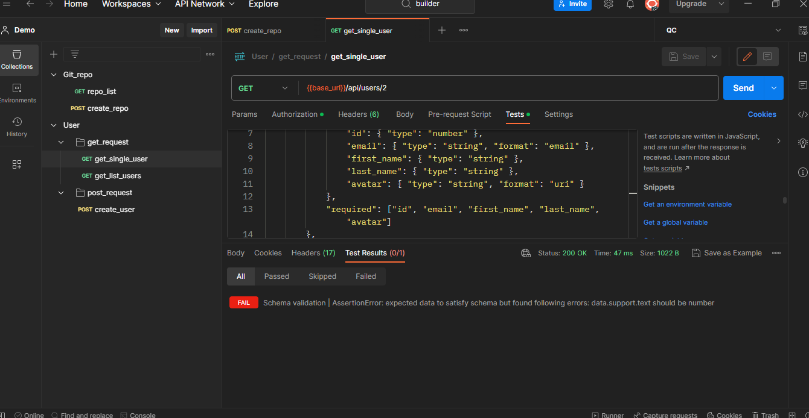


Performance Test:

Performance testing enables you to simulate user traffic, so you can observe how your API behaves under load and find out if the performance meets expectations. It can also help you identify any issues or bottlenecks that affect performance. You can use the Collection Runner to test the performance of your API with the same requests, collections, and environments 
A host with 8 CPU cores and 16 GB RAM can simulate up to 250 virtual users
A host with 16 CPU cores and 32 GB RAM can simulate up to 500 virtual users
Postman recommends running a small test with 10 to 20 virtual users and observing system resource usage. You can use this information to estimate that maximum number of virtual users that can be simulated for your collection and host computer.
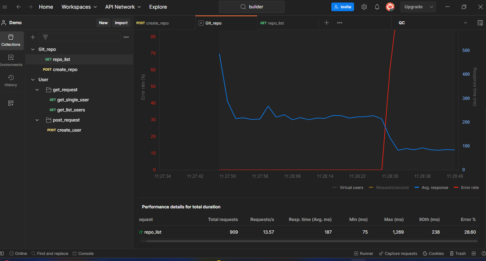

### Test Automation :

Schedule runs : Periodically run collection at a specified time on the Postman Cloud

CLI:

How to run postman requests/tests from command line 
1. Install node.js
2. Install newman (npm install -g newman)
3. export collection and run from commandline
 Command : newman run url ( Eg. https://api.postman.com/collections/27995880-66242b3e-eddb-4d6e-868b-aad4e7d98a60?access_key=PMAT-01H3MCHT06VV6CARMQ7WWFNPHW) or newman run "export  json file name"

CI/CD pipeline:

integrate with a continuous integration/continuous delivery (CI/CD) tool.
export and run in CI jenkis or Generate Postman CLI Configuration via postman and setup.

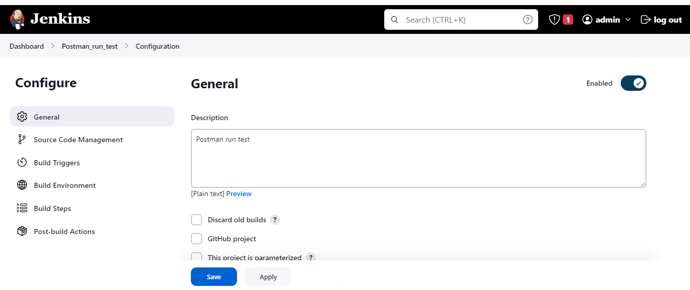

### Documentation: 

Postman provides a feature called "API documentation" that allows you to create, organize, and publish comprehensive documentation for your APIs.

- Create a Postman Collection representing your API.
- Add descriptions, examples, and expected responses to each request.
- Include code snippets to demonstrate API usage.
- Document authentication methods, if applicable.
- Generate documentation using the "Publish" feature.
- Share the documentation URL with your team or API consumers.

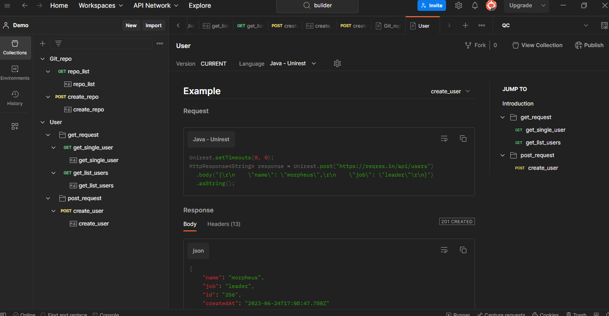


### Postman Flows 

Postman Flows is a visual tool to build API-driven applications.Flows are the ultimate way to easily take data from an API-enabled product, manipulate it to meet your needs, and see the results. Or you could take data from one API-enabled product, make decisions or process the data, then send it to another API-enabled product. This means you can build real-time integrations between two API-enabled products.

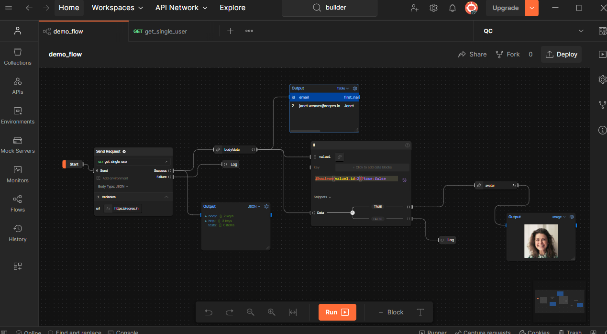


### Cookies :

HTTP cookies are small pieces of data stored on the client-side (e.g., web browser) by websites. They are commonly used to track user sessions, store user preferences, and provide personalized experiences. When a client makes a request to a server, it includes the cookies associated with that domain, allowing the server to identify and authenticate the user.
ostman, as an HTTP client tool, supports automatic handling of HTTP cookies. It stores cookies received in responses and includes them in subsequent requests to the same domain. You can manually add cookies to requests using the "Headers" tab in Postman. The "Cookies" tab allows you to inspect the cookies received in responses.


## Instructions

- Open Postman webpage - https://www.getpostman.com/
- Create a free account and Activate the account
- Download and install postman app or you can use in web browser as well 


## Example Command:
- None for now

