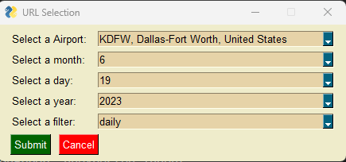
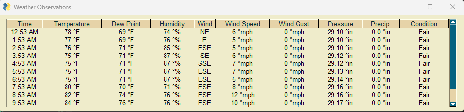
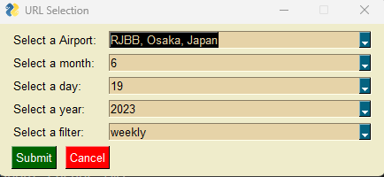
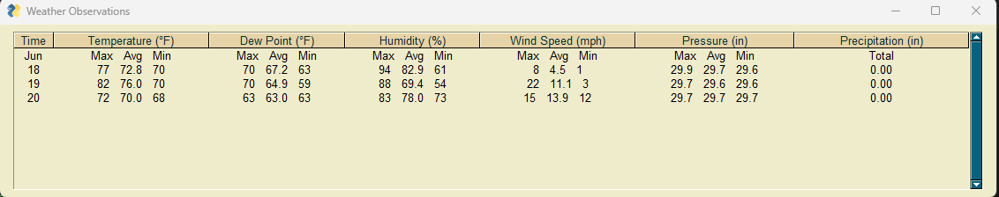
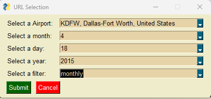
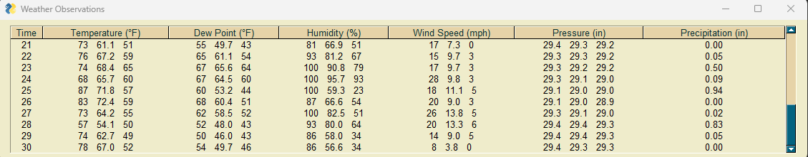

## A07 - Web Scraping
### Madhav Adhikari

### Description:
This project combined a python GUI with a beautiful soup web scraper from https://www.wunderground.com/history/daily/ to collect and  display the data. The initial python gui will be used to enter the appropriate values to allow you to leverage the URL, meaning it will accept values for: month, day, year, airport code, and one of the following: daily, weekly, monthly. The resulting python gui will display the received data in a tabular format.I have done following steps to do this project.

- Create a data entry form (input form) that includes select a day, select month, select a year, select a airport, select a filter (daily,weekly,monthly) input fields and sumbit and cancle button using PySimpleGui. All input fields have dropdown values 
range from 1 to 12 for  month, range from 1 to 32 for day , range from 2000 to 2023 for year, daily,weekly and monthly for filter and list of code from airports.json file for airport. Current month, day, year , daily and KDFW, Dallas-Fort Worth, United States are default placeholder in inputfields respectively.

- After submitting input form, create the appropriate URL (url = f"{base_url}/{filter}/{airport}/date/{year}-{month}-{day}") to query wunderground for the specified weather data 
- Use selenium to obtain the async data sent back from wunderground.
- Use BS4 to parse the data and pull out the requested data.
- Finally, use PySimpleGui tabular view to display the data received from the initial request.

### Sample input and output
-  Select airport : KDFW, month:6, day:19, year:2023 and filter: daily then sumbit the form and following output will be displayed.

-  Select airport : RJBB, month:6, day:19, year:2023 and filter: weekly then sumbit the form and following output will be displayed.

-  Select airport : KDFW, month:4, day:18, year:2015 and filter: monlthy then sumbit the form and following output will be displayed.

### Files

|   #   | File            | Description                                        |
| :---: | --------------- | -------------------------------------------------- |
|   1   | [airports.json](airports.json)      | file that holds airport code ,city and country   |
|   2   | [input_form.py ](input_form.py)     | file that holds code for input GUI    |
|   3   | [display_form.py](display_form.py)      | file that holds code for output GUI   |
|   4   | [main.py](main.py)      | main driver file which inititate to run program    |
|   5   | [requirements.txt](requirements.txt)     | file that holds list of dependencies for this project   |

### Instructions

- Make sure you install all dependencies from requirments.txt
- Place the airport.json files in your location and change the path in code accordingly

### Example Command:
- python main.py

