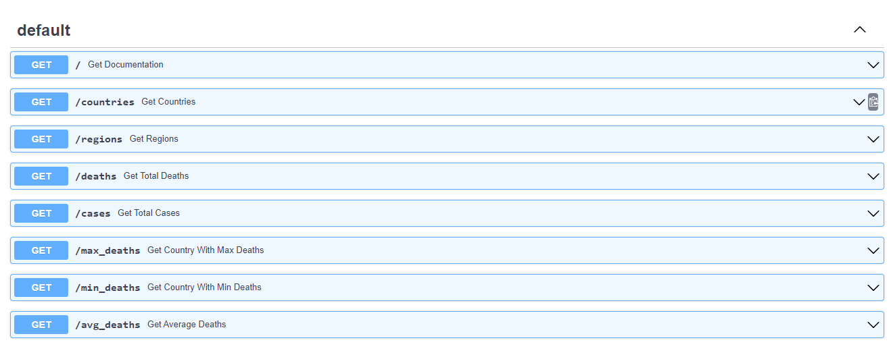

# A08 - Fast Api with Covid Data
## Madhav Adhikari
## Description:

This project will create a RESTful API using FastAPI that provides access to COVID-19 data. The API will fetch the data from data.csv (covid data) and expose endpoints to retrieve various statistics related to COVID-19 cases. I have used pandas to read , apply filter, grouping of data , fastapi for api endpoint and uvicorn server for  hosting locahost of API. I have created follwing api end points.

### Generic Routes
- Route: /
  
  This is a root url (http://127.0.0.1:8000/) of api which is redired to /doc that is used to retrieves the documentation provided by swagger.

  
  
- Route: /countries
    
  This method will retrieves a list of unique countries

  - **Params:**
    - None

  - **Returns:**
    - (object) : list of countries 

  #### Request Url Example:

  [http://127.0.0.1:8000/countries](http://127.0.0.1:8000/countries)

  #### Response boady Example:
  ```json
        {
            "countries": [
                "Afghanistan",
                "Albania",
                "Algeria",
                "American Samoa"
                ],
            "success": True
        }
  ``` 

- Route: /regions
  
  This method will retrieves a list of available WHO regions
    - **Params:**
      - None
    
    - **Returns:**
      - (object) : list of regions 

    #### Request Url Example:

    [http://127.0.0.1:8000/regions](http://127.0.0.1:8000/regions)

    #### Response boady Example:
     ```json
        {
        "regions": [
            "EMRO",
            "EURO",
            "AFRO",
            "WPRO",
            "AMRO",
            "SEARO",
            "Other"
        ],
        "success": true
        }
     ```

### Death Routes
- Route: /deaths  or 
- /deaths?country= \<country> or  
- /deaths?region= \<region> or 
-  /deaths?country=\<country>&year=\<year> or 
-   /deaths?region=\<region>&year=\<year>

This method will return a total death count or can be filtered by country or region or year.

- **Params:**
    - country (str) : A country name
    - region (str) : A region name
    - year (int) : A 4 digit year
- **Returns:**
    - (int) : The total sum based on filters (if any)

#### Request URL Example 1:

[http://127.0.0.1:8000/deaths](http://127.0.0.1:8000/deaths)

#### Response boady example 1:
   ```json
    {
    "total_deaths": 6945714,
    "params": {
        "country": null,
        "region": null,
        "year": null
    },
    "success": true
    }
  ```  
#### Request URL Example 2:

[http://127.0.0.1:8000/deaths?country=Nepal&year=2023](http://127.0.0.1:8000/deaths?country=Nepal&year=2023)

#### Response boady example 2:

   ```json
    {
    "total_deaths": 12,
    "params": {
        "country": "Nepal",
        "region": null,
        "year": 2023
    },
    "success": true
    }
   ``` 

### Case Routes
- Route: /cases  or 
- /cases?country= \<country> or  
- /cases?region= \<region> or 
- /cases?country=\<country>&year=\<year> or 
-  /cases?region=\<region>&year=\<year>

This method will return a total new cases count or can be filtered by country or region or year.

- **Params:**
    - country (str) : A country name
    - region (str) : A region name
    - year (int) : A 4 digit year
- **Returns:**
    - (int) : The total sum based on filters (if any)

#### Request URL Example 1:

[http://127.0.0.1:8000/cases](http://127.0.0.1:8000/cases)

#### Response boady example 1:
   ```json
    {
    "total_cases": 768187096,
    "params": {
        "country": null,
        "region": null,
        "year": null
    },
    "success": true
    }
   ``` 
#### Request URL Example 2:

[http://127.0.0.1:8000/cases?country=Nepal&year=2023](http://127.0.0.1:8000/cases?country=Nepal&year=2023)

#### Response boady example 2:

   ```json 
   {
    "total_cases": 2361,
    "params": {
        "country": "Nepal",
        "region": null,
        "year": 2023
    },
    "success": true
    }
   ```

### Aggregate Routes
- Route: /max_deaths or Route: /max_deaths?min_date=\<date>&max_date=\<date>
  
    This method will find the country with the most deaths or find the country with the most deaths between a range of dates.

    - **Params:**
        - min_date (str) : start date
        - max_date (str) : end date
    - **Returns:**
        - (int) : max death with country

    #### Request URL Example 1:

    [http://127.0.0.1:8000/max_deaths](http://127.0.0.1:8000/max_deaths)

    #### Response boady example 1:
    ```json
        {
        "max_deaths_country": "United States of America",
        "cumulative_deaths": 1127152,
        "params": {
            "min_date": null,
            "max_date": null
        },
        "success": true
        }
    ```

    #### Request URL Example 2:

    [http://127.0.0.1:8000/max_deaths?min_date=2021-06-01&max_date=2021-12-31](http://127.0.0.1:8000/max_deaths?min_date=2021-06-01&max_date=2021-12-31)

    #### Response boady example 2:
    ```json
        {
        "max_deaths_country": "United States of America",
        "cumulative_deaths": 819055,
        "params": {
            "min_date": "2021-06-01",
            "max_date": "2021-12-31"
        },
        "success": true
        }
    ```

- Route: /min_deaths or Route: /min_deaths?min_date=\<date>&max_date=\<date>
  
    This method will find the country with the least deaths or find the country with the least deaths between a range of dates.

    - **Params:**
      - min_date (str) : start date
      - max_date (str) : end date
    - **Returns:**
      - (int) : least death with country

    #### Request URL Example 1:

    [http://127.0.0.1:8000/min_deaths](http://127.0.0.1:8000/min_deaths)

    #### Response boady example 1:
     ```json   
       {
        "min_deaths_country": "Democratic People's Republic of Korea",
        "cumulative_deaths": 0,
        "params": {
            "min_date": null,
            "max_date": null
        },
        "success": true
        }
     ```
    #### Request URL Example 2:

    [http://127.0.0.1:8000/min_deaths?min_date=2021-06-01&max_date=2021-12-31](http://127.0.0.1:8000/min_deaths?min_date=2021-06-01&max_date=2021-12-31)

    #### Response boady example 2:
     ```json
        {
        "min_deaths_country": "American Samoa",
        "cumulative_deaths": 0,
        "params": {
            "min_date": "2021-06-01",
            "max_date": "2021-12-31"
        },
        "success": true
        }
     ```   
- Route: /avg_deaths
  
  This method will retrieves the average number of deaths between all countries and each country average death as well.
  Average death= total cumulative_deaths / total cumulative_cases (per country as well )
    - **Params:**
      - None
    
    - **Returns:**
      - (float) : the average number of deaths between all countries and each country average death as well

    #### Request Url Example:

    [http://127.0.0.1:8000/avg_deaths](http://127.0.0.1:8000/avg_deaths)

    #### Response boady Example:
    ```json 
          {
            "overall_death_average":{
                  "overall_cumulative_deaths": 1127152,
                  "overall_cumulative_cases": 103436829,
                  "countries_count": 237,
                  "overall_average_deaths": "0.010897008453343054"
            },
            "average_deaths_per_country":{
                "Afghanistan":{
                    "cumulative_cases":222954,
                    "cumulative_deaths":7922,
                    "average_deaths":"0.03553199314656835"
                },
                "Albania":{
                    "cumulative_cases":334090,
                    "cumulative_deaths":3604,
                    "average_deaths":"0.010787512346972374"
                }
            },
            "success":true
        }
    ```

### Error handling

If we got any params issue or coding issue then the response will get with error message.
 
  #### Request Url Example:
  [http://127.0.0.1:8000/max_deaths?min_date=mmm&max_date=mm](http://127.0.0.1:8000/max_deaths?min_date=mmm&max_date=mm)

  #### Response boady Example:
  ```json 
       {
        "error": "attempt to get argmax of an empty sequence",
        "success": false,
        "params": {
            "min_date": "mmm",
            "max_date": "mm"
            }
        }
  ```


## Files

|   #   | File            | Description                                        |
| :---: | --------------- | -------------------------------------------------- |
|   1   | [data.csv  ](data.csv)      | file that holds covid data    |
|   2  | [main.py](main.py)     | file that holds python code for api routes    |
|   3 | [requirements.txt](requirements.txt)   | file that holds list of dependencies for this project    |


## Instructions

- Make sure you install all dependencies from requirments.txt

## Example Command:
- uvicorn main:app --reload  or python main.py

